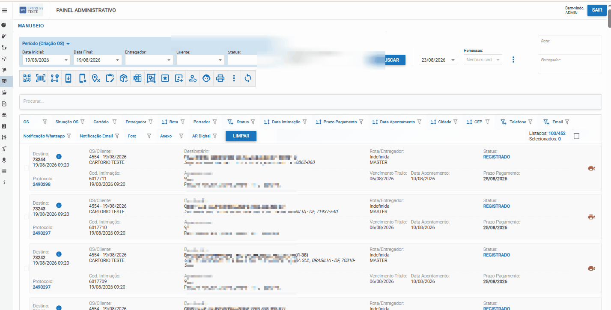

# Atribuir Rotas aos Selecionados

## O que é Atribuição Manual de Rotas?

Atribuição manual de rotas é a função que permite **atribuir manualmente rotas específicas** para intimações que ficaram com status **"Rota Indefinida"** após a reatribuição automática.

---

## Por que Existem Rotas Indefinidas?

### Causa Principal: Bairros Abreviados ou Não Mapeados

Quando o sistema do cartório envia intimações, às vezes os bairros vêm em **formato abreviado** que **não está no documento original** de mapeamento de rotas.

**Exemplo Real:**

```
Mapeamento Original:        Sistema do Cartório Envia:
└─ "Vila Mariana"    VS     └─ "V. Mariana"
└─ "Zona Sul"        VS     └─ "Z. Sul"  
└─ "Bom Retiro"      VS     └─ "B. Retiro"

Resultado: Rota Indefinida ❌
```

### Outras Causas

- Bairros novos não cadastrados nas rotas
- Digitação diferente no sistema
- Mudanças de nomenclatura
- Localidades específicas não previstas

---

## Objetivo: Zero Entregas Indefinidas

O objetivo é **chegar a ZERO entregas indefinidas**, adicionando progressivamente novos termos às rotas até cobrir todas as variações.

```
Entrega 1: "V. Mariana" → Rota 3
Entrega 2: "Vila Mariana" → Rota 3
Entrega 3: "Z. Sul" → Rota 1
...
Resultado Final: Zero indefinidas ✅
```

---

## Visualização: Atribuir Rotas aos Selecionados



> 💡 **Dica:** Use Ctrl + para aumentar o zoom se a imagem ficar pequena

---

## Passo a Passo: Atribuir Rotas Manualmente

### Passo 1: Localizar Rotas Indefinidas

Na página de **Intimações**, procure pelas intimações com status:
- "Rota Indefinida"
- "Sem Rota"
- "Rota Não Definida"

**Dica:** Use o filtro de "Status" para mostrar apenas indefinidas.

---

### Passo 2: Selecionar Intimações

Marque as checkboxes das intimações que deseja atribuir:

**Opção A: Uma por Uma**
```
☑ Intimação 001 - V. Mariana - Rota Indefinida
☑ Intimação 002 - Z. Sul - Rota Indefinida
☑ Intimação 003 - B. Retiro - Rota Indefinida
```

**Opção B: Agrupar por Termo**
```
☑ Todas com "V. Mariana" (5 selecionadas)
→ Atribuir todas à Rota 3 de uma vez
```

---

### Passo 3: Acessar Função de Atribuição

**No menu de ações**, procure:
- "Atribuir Rotas aos Selecionados"
- "Colocar destinos selecionados em Rota"
- "Definir Rota para Selecionadas"

(Nome pode variar conforme versão da plataforma)

---

### Passo 4: Escolher a Rota

Será exibida uma tela com opções de rotas disponíveis:

```
Selecione a Rota:
┌─────────────────────┐
│ Rota 1 (Zona Sul)   │
│ Rota 2 (Zona Norte) │
│ Rota 3 (Vila Area)  │ ← Escolher
│ Rota 4 (Centro)     │
│ Rota 5 (Zona Leste) │
└─────────────────────┘
```

---

### Passo 5: Confirmar Atribuição

Clique em **"Confirmar"** ou **"Atribuir Rota"**

```
Processando...
✅ Intimação 001 atribuída à Rota 3
✅ Intimação 002 atribuída à Rota 1  
✅ Intimação 003 atribuída à Rota 3

Sucesso! 3 intimações atribuídas.
```

---

## Adicionar Novos Termos às Rotas

### O Processo

Após atribuir manualmente, os desenvolvedores podem **adicionar os novos termos ao mapeamento de rotas**.

**Exemplo:**

```
Antes (Rota 3):
└─ "Vila Mariana"

Depois (Rota 3):
├─ "Vila Mariana"
├─ "V. Mariana"      ← Novo termo adicionado
└─ "Vila Mariana Ext"← Novo termo adicionado
```

### Para Próximas Edições

Essas novas abreviações/variações serão incluídas na **próxima atualização das rotas**.

**Processo:**
1. Cartório coleta os termos não mapeados
2. Documenta em planilha
3. Envia aos desenvolvedores
4. Desenvolvedores atualizam o mapeamento
5. Sistema reprocessa com novos termos

---

## Fluxo Iterativo Até Zero Indefinidas

```
Ciclo 1:
├─ Enviar intimações
├─ Reatribuir rotas
├─ Resultado: 50 indefinidas
├─ Atribuir manualmente as 50
└─ Adicionar novos termos

Ciclo 2:
├─ Próximo lote de intimações
├─ Reatribuir rotas  
├─ Resultado: 15 indefinidas (melhorou!)
├─ Atribuir manualmente as 15
└─ Adicionar novos termos

Ciclo 3:
├─ Próximo lote
├─ Reatribuir rotas
├─ Resultado: 2 indefinidas (quase lá!)
├─ Atribuir manualmente as 2
└─ Adicionar novos termos

Ciclo 4:
├─ Próximo lote
├─ Reatribuir rotas
├─ Resultado: ZERO indefinidas ✅
└─ Rotas estão maduras!
```

---

## Dicas Práticas

### 💡 Organize por Termo
Agrupe as rotas indefinidas por bairro/termo para atribuição mais rápida:

```
"V. Mariana" (5 intimações) → Rota 3
"Z. Sul" (3 intimações) → Rota 1
"B. Retiro" (2 intimações) → Rota 2
```

### 💡 Documente Cada Adição
Mantenha registro dos termos adicionados:

```
Data     | Termo Adicionado | Rota | Motivo
---------|------------------|------|--------
22/08    | V. Mariana       | 3    | Abreviação encontrada
22/08    | Z. Sul           | 1    | Abreviação encontrada
```

### 💡 Revise Periodicamente
Após cada ciclo, verifique quantas indefinidas restaram para acompanhar o progresso.

---

## Checklist: Atribuição Manual de Rotas

- [ ] Filtradas apenas intimações com rota indefinida
- [ ] Agrupadas por bairro/termo para atribuição rápida
- [ ] Selecionadas as intimações
- [ ] Acessada função "Atribuir Rotas aos Selecionados"
- [ ] Escolhida a rota correta
- [ ] Confirmada atribuição
- [ ] Documentados os termos adicionados
- [ ] Repassado para desenvolvedores atualizar mapeamento
- [ ] Verificado resultado final

---

## Próximo Passo

Após atingir **ZERO rotas indefinidas**, as intimações estão prontas para:
- ✅ Envio aos Entregador(motoboy)s
- ✅ Distribuição e execução
- ✅ Acompanhamento das entregas

Retorne à [Reatribuição de Rotas](./03-reatribuicao-rotas.md) quando tiver novo lote de intimações.
