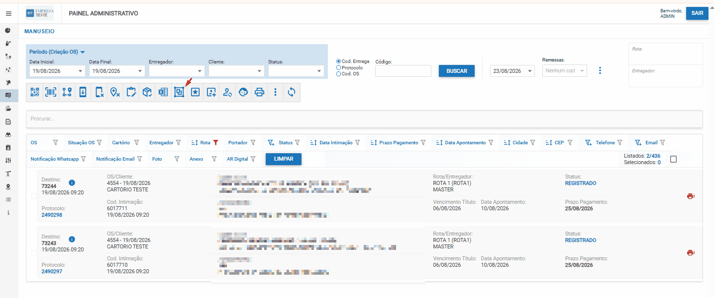

# Agrupamento de Entregas

## O que é Agrupamento?

Agrupamento é um **algoritmo** que a plataforma executa para **agrupar os destinos por endereço**, utilizando similaridade entre endereços e deixando-os em **ordem alfabética** para facilitar a distribuição posterior.

**Objetivo:** Organizar as entregas de forma inteligente para otimizar o envio aos motoboys.

---

## Visualização: Função Agrupamento



> 💡 **Dica:** Use Ctrl + para aumentar o zoom se a imagem ficar pequena

---

## Quando Usar Agrupamento

### ✅ Após Reatribuição de Rotas
- Após executar "Reatribuir Rotas" e ter as intimações distribuídas nas rotas condicionais
- Antes de enviar para o entregador

### ✅ Após Filtrar por Rotas
- Depois de aplicar filtros no sistema
- O agrupamento organiza o resultado do filtro

### ✅ Para Otimizar Distribuição
- Quando deseja deixar as entregas melhor organizadas
- Para facilitar o envio ao motoboy

---

## Como Funciona o Agrupamento

### **Passo 1: Filtrar Rotas**

1. Acesse a página de **Intimações**
2. Aplique os filtros desejados (rota, status, período, etc.)
3. Tenha as intimações filtradas e prontas

### **Passo 2: Aplicar Agrupamento**

1. Com as intimações filtradas visíveis
2. Procure pela opção **"Agrupamento"** no menu
3. Clique para aplicar

### **Passo 3: Resultado**

O agrupamento:
- ✅ Agrupa destinos por endereço
- ✅ Ordena alfabeticamente
- ✅ Organiza as entregas
- ✅ Deixa pronto para distribuição

---

## Benefícios do Agrupamento

| Benefício | Descrição |
|-----------|-----------|
| **Organização** | Entregas agrupadas por endereço |
| **Facilidade** | Ordem alfabética para acesso rápido |
| **Eficiência** | Reduz tempo na distribuição aos motoboys |
| **Clareza** | Entregas já estruturadas para o entregador |

---

## Fluxo Completo

```
1. Envio de Intimações
        ↓
2. Reatribuição de Rotas (automática)
        ↓
3. Filtrar Rotas (se necessário)
        ↓
4. Agrupamento de Entregas ← Você está aqui
        ↓
5. Colocar em Rota (distribuir ao entregador)
        ↓
6. Entrega aos Motoboys
```

---

## Próximo Passo

Após agrupar as entregas, prossiga para a distribuição: [Distribuição de Rotas aos Entregadores](#)

---

## Checklist: Agrupamento

- [ ] Acesso à página de Intimações
- [ ] Filtros aplicados corretamente
- [ ] Agrupamento executado
- [ ] Entregas organizadas por endereço
- [ ] Ordem alfabética verificada
- [ ] Pronto para próximo passo
