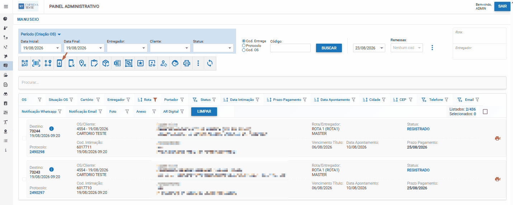

# Envio de Rota para Entregador

## O que é Envio de Rota?

Envio de Rota é o processo de **enviar os destinos/entregas agrupadas para o aplicativo do entregador (motoboy)**, após já terem sido filtradas e agrupadas por rota.

**Objetivo:** Disponibilizar as entregas organizadas no app mobile para que o motoboy possa executar as entregas.

---

## Visualização: Envio de Rota para Entregador



> 💡 **Dica:** Use Ctrl + para aumentar o zoom se a imagem ficar pequena

---

## Quando Fazer Envio de Rota

### ✅ Após Agrupamento de Entregas
- Depois de agrupar os destinos
- Antes de enviar ao motoboy

### ✅ Com Entregas Já Filtradas
- As entregas já devem estar filtradas por rota
- E agrupadas para melhor organização

### ✅ Pronto para Execução
- Quando as entregas estão prontas para o entregador
- No momento de distribuição

---

## Como Funcionar o Envio

### **Passo 1: Selecionar Entregas**

1. Na página de **Intimações**
2. Filtre as entregas por rota
3. Agrupe os destinos (se não feito ainda)
4. **Selecione as entregas** que deseja enviar

### **Passo 2: Enviar para o Entregador**

1. Com as entregas selecionadas
2. Procure pela opção **"Enviar para o Entregador"** ou **"Enviar Rota"**
3. **Clique para enviar** ao aplicativo do motoboy

### **Passo 3: Confirmação**

1. O sistema processa o envio
2. As entregas aparecem no **app mobile do entregador**
3. O motoboy pode visualizar e executar as entregas

---

## Resultado: Motoboy Recebe Entregas

Após o envio:
- ✅ Entregas aparecem no app do motoboy
- ✅ Organizadas por rota
- ✅ Em ordem (agrupadas)
- ✅ Prontas para execução

---

## Fluxo Completo de Distribuição

```
1. Envio de Intimações
        ↓
2. Reatribuição de Rotas (automática)
        ↓
3. Filtrar Rotas
        ↓
4. Agrupamento de Entregas
        ↓
5. Envio de Rota para Entregador ← Você está aqui
        ↓
6. Motoboy Recebe no App
        ↓
7. Execução das Entregas
```

---

## Boas Práticas

### 💡 Verificar Antes de Enviar
- Valide que as entregas estão corretas
- Confirme as rotas e agrupamento
- Verifique se não há erros

### 💡 Acompanhar Envio
- Verifique se as entregas chegaram ao app
- Confirme com o motoboy o recebimento
- Esteja disponível para suporte

### 💡 Registrar Envios
- Documente quais rotas foram enviadas
- Registre a data e hora
- Mantenha histórico para auditoria

---

## Checklist: Envio de Rota

- [ ] Entregas filtradas por rota
- [ ] Entregas agrupadas
- [ ] Verificação realizada
- [ ] Envio executado
- [ ] Confirmação do recebimento (app do motoboy)
- [ ] Histórico registrado

---

## Próximo Passo

Após enviar para o entregador, o motoboy executa as entregas conforme a rota recebida.

**Acompanhamento:** Verifique o status das entregas no app do motoboy ou no dashboard de operações.
