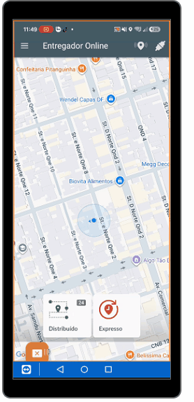

# Ordenação de Entregas no App

## O que é Ordenação?

Ordenação é a **reorganização manual das entregas** no aplicativo do Entregador(motoboy) de acordo com sua **experiência e planejamento de rota**.

**Objetivo:** Deixar as entregas na melhor sequência para executar no dia.

---

## Quando as Entregas Chegam

Depois que realizamos o **agrupamento na plataforma** e **enviamos as entregas para o app**:

1. ✅ Entregador loga no aplicativo
2. ✅ Entregas aparecem na **aba "Distribuído"**
3. ✅ Cada entrega mostra seu respectivo **boleto**
4. ✅ Estão agrupadas conforme o agrupamento realizado

---

## Como Fazer a Ordenação

### **Passo 1: Acessar a Aba Distribuído**
1. Abra o aplicativo
2. Faça login
3. Acesse a aba **"Distribuído"**

### **Passo 2: Encontrar a Opção de Ordenação**
1. Procure pelos **três pontinhos (⋮)** no canto superior direito
2. Clique para abrir o menu

### **Passo 3: Selecionar Ordenação**
1. No menu que abre, procure pela opção **"Ordenar"** ou **"Ordenação"**
2. Clique para ativar o modo de ordenação

### **Passo 4: Reorganizar Manualmente**
1. **Drag and drop** das entregas na ordem desejada
2. Organize conforme sua experiência e planejamento
3. Deixe as prioridades primeiro

### **Passo 5: Salvar e Sair**
1. Após organizar, clique para **confirmar a ordenação**
2. Pronto para executar as entregas na nova ordem

---

## Por Que é Importante?

| Benefício | Descrição |
|-----------|-----------|
| **Otimização** | Entregador(motoboy) segue a melhor rota possível |
| **Experiência** | Aproveita conhecimento do entregador |
| **Velocidade** | Reduz tempo total de entrega |
| **Eficiência** | Melhor organização do dia |

---

## Demonstração: Ordenação de Entregas

Veja na prática como fazer a ordenação:



> 💡 **Dica:** Use Ctrl + para aumentar o zoom se a imagem ficar pequena

---

## Fluxo da Ordenação

```
1. Login no App
        ↓
2. Aba "Distribuído"
        ↓
3. Entregas Agrupadas (vêm da plataforma)
        ↓
4. Menu (três pontinhos)
        ↓
5. Opção "Ordenar"
        ↓
6. Reordenar Manualmente
        ↓
7. Confirmar Ordenação ✅
        ↓
8. Pronto para Executar Entregas
```

---

## Boas Práticas

### 💡 Considerar ao Ordenar
- Proximidade entre endereços
- Horários de funcionamento (comércio, residência)
- Dificuldade de acesso
- Experiência anterior com o devedor

### 💡 Anotações Anteriores
- Verifique anotações de entregas anteriores
- Use a informação para melhor abordagem
- Considere na sequência da rota

### 💡 Flexibilidade
- A ordenação pode ser ajustada durante o dia
- Imprevistos podem mudar a rota
- Reordene conforme necessário

---

## Próximo Passo

Após ordenar, o entregador executa cada entrega conforme a nova ordem:

[Ver: Baixa de Entregas](./02-baixa-entregas.md)

---

## Checklist: Ordenação

- [ ] Login realizado
- [ ] Aba "Distribuído" acessada
- [ ] Entregas visíveis
- [ ] Menu (⋮) localizado
- [ ] Opção "Ordenar" encontrada
- [ ] Entregas reordenadas
- [ ] Ordem otimizada para rota
- [ ] Ordenação confirmada
- [ ] Pronto para executar

