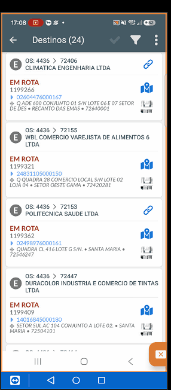

# Baixa de Entregas no App

## O que é Baixa de Entrega?

Baixa é o **registro completo de uma entrega realizada** no aplicativo do motoboy, incluindo:
- Status da entrega
- Informações adicionais
- Comprobantes (foto, assinatura)
- Sincronização com nuvem

**Objetivo:** Registrar e confirmar a execução da entrega em tempo real.

---

## Fluxo Geral de Execução

Após a ordenação, o entregador segue para executar cada entrega:

```
1. Sai com Entregas Ordenadas
        ↓
2. Chega no Endereço do Destinatário
        ↓
3. Imprime Boleto (Bluetooth + Impressora Térmica)
        ↓
4. Faz a Abordagem e Entrega
        ↓
5. Marca Status (Entregue, Devolvido, etc.)
        ↓
6. Preenche Campos Adicionais
        ↓
7. Coloca Anotações (importante!)
        ↓
8. Coleta Foto e/ou Assinatura
        ↓
9. Sincroniza com Nuvem ☁️
        ↓
10. Finaliza a Baixa ✅
```

---

## Passo a Passo Detalhado

### **Passo 1: Chegar no Endereço**
1. Entregador chega no local da entrega
2. Localiza o devedor ou responsável
3. Apresenta-se como entregador

### **Passo 2: Imprimir o Boleto**
**Via Bluetooth - Impressora Térmica:**
1. Pareamento prévio da impressora ao celular
2. Seleciona a opção **"Imprimir Boleto"**
3. Envia para a impressora térmica via Bluetooth
4. Entrega o boleto impresso ao devedor

### **Passo 3: Marcar Status**
**Selecione o status apropriado:**

- `Entregue` - Intimação entregue com sucesso
- `Devolvido` - Devolvido ao cartório
- `Não Localizado` - Endereço não existe
- `Recusado` - Devedor recusou receber
- `Outro` - Conforme configuração

**Exemplo: Clique em "Entregue"** (caso tenha sido bem-sucedido)

### **Passo 4: Sincronizar com Nuvem**
1. Após marcar o status, procure pelo **ícone da nuvem** (☁️)
2. Clique para sincronizar
3. **Dados sobem para nuvem automaticamente**
4. Sistema de operações recebe em tempo real
5. Cartório consegue importar os dados

### **Passo 5: Preencher Campos Adicionais**

**Nome do Devedor:**
- Identifique quem recebeu a entrega
- Digite o nome completo

**Observação:**
- Adicione detalhes relevantes
- Motivo da devolução (se aplicável)
- Informações sobre a abordagem

### **Passo 6: Adicionar Anotações** ⭐ IMPORTANTE

As anotações são **muito importantes**:

✅ **Fica vinculada ao CPF/CNPJ do devedor**
✅ **Próximas entregas herdam essa anotação**
✅ **Facilita segunda abordagem**

**Exemplos de Anotações:**
- "Devedor trabalha 9h-18h em casa"
- "Aceita entrega de segunda a sexta"
- "Vizinho pode receber"
- "Horário melhor para abordagem: manhã"
- "Já conhece o produto"

### **Passo 7: Coleta de Comprobantes**

**Foto:**
- Opcional ou obrigatório (conforme cartório)
- Clique em **"Tirar Foto"**
- Fotografe o local ou comprovante de entrega
- Salva como evidência

**Assinatura:**
- Opcional ou obrigatório (conforme cartório)
- Clique em **"Colher Assinatura"**
- Destinatário assina na tela do celular
- Confirma o recebimento

### **Passo 8: Finalizar a Baixa**
1. Após preencher todos os campos necessários
2. Clique em **"Finalizar"** ou **"Confirmar"**
3. A entrega é registrada no app
4. Sistema atualiza em tempo real
5. Pronto para próxima entrega

---

## Campos da Entrega

### **Status**
- Campo obrigatório
- Determina o resultado da entrega

### **Nome do Devedor**
- Identificação de quem recebeu
- Campo importante para rastreamento

### **Observação**
- Detalhes adicionais
- Campo livre para informações

### **Anotação** ⭐
- Vinculada ao CPF/CNPJ
- Visível em próximas entregas
- Facilita próxima abordagem

### **Foto**
- Comprovante visual
- Pode ser obrigatória

### **Assinatura**
- Confirmação de recebimento
- Pode ser obrigatória

---

## Sincronização em Tempo Real

### **Nuvem ☁️**
- Clique no ícone da nuvem após marcar status
- Dados sincronizam imediatamente
- Plataforma de operações recebe a informação
- Cartório consegue importar em tempo real

### **Vantagens**
✅ Rastreamento instantâneo
✅ Cartório atualizado em tempo real
✅ Sem atraso na informação
✅ Maior confiabilidade

---

## Demonstração: Baixa de Entregas

Veja na prática como fazer a baixa:



> 💡 **Dica:** Use Ctrl + para aumentar o zoom se a imagem ficar pequena

---

## Fluxo de Informações

```
Motoboy Marca Status
        ↓
Sincroniza na Nuvem ☁️
        ↓
Sistema de Operações Recebe
        ↓
Plataforma Atualiza em Tempo Real
        ↓
Cartório Consegue Importar ✅
```

---

## Boas Práticas

### 💡 Na Abordagem
- Seja educado e profissional
- Explique a intimação
- Entregue o boleto impresso
- Colha comprobantes se necessário

### 💡 Nas Anotações
- Seja específico e útil
- Pense no próximo entregador
- Informações sobre horário, acesso, etc.
- Facilita segunda abordagem

### 💡 Após Finalizar
- Verifique se sincronizou
- Confirme status na plataforma
- Tire dúvidas com supervisão se necessário
- Siga para próxima entrega

### 💡 Tratamento de Devoluções
- Registre motivo claramente
- Adicione observações detalhadas
- Anotações sobre próxima tentativa
- Devolva boleto se necessário

---

## Status Comuns

| Status | Quando Usar | Observação |
|--------|------------|-----------|
| **Entregue** | Intimação entregue com sucesso | Mais comum |
| **Devolvido** | Devolver ao cartório | Registre motivo |
| **Não Localizado** | Endereço inexistente | Adicione anotação |
| **Recusado** | Devedor recusou | Detalhes importantes |
| **Outro** | Conforme configuração | Consulte supervisor |

---

## Checklist: Baixa de Entrega

- [ ] Chegada no endereço confirmada
- [ ] Devedor ou responsável localizado
- [ ] Boleto impresso via Bluetooth
- [ ] Boleto entregue ao devedor
- [ ] Status selecionado
- [ ] Nuvem sincronizada (☁️)
- [ ] Nome do devedor preenchido
- [ ] Observações adicionadas
- [ ] Anotações preenchidas (importante!)
- [ ] Foto/Assinatura coletada (se necessário)
- [ ] Baixa finalizada ✅

---

## Próximo Passo

Após finalizar a baixa, prossiga para a próxima entrega seguindo a ordem estabelecida.

Caso tenha problemas na sincronização ou dúvidas, consulte o supervisor.

